# wtAnd

**Deutsch** · [English](README.en.md)

<p align="center">
  
</p>

<p align="center">
  <a href="https://github.com/thobgg/app4webtrees/releases/latest"></a>
  <a href="https://github.com/thobgg/app4webtrees/releases/latest"></a>
  <a href="https://github.com/thobgg/app4webtrees/releases/latest"></a>
</p>

<p align="center">
  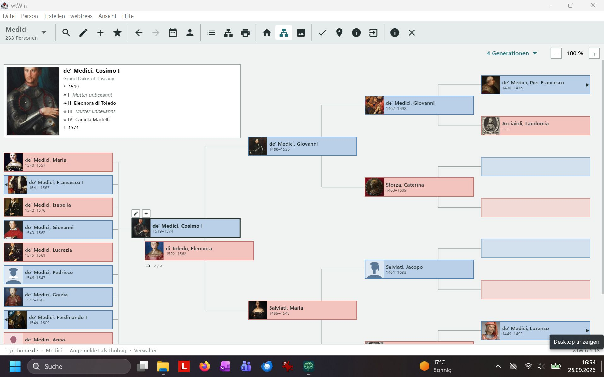
  <br><b>wtWin unter Windows</b> – derselbe Stammbaum wie in wtAnd, aufgebaut wie ein klassisches Genealogie-Programm.
</p>

| 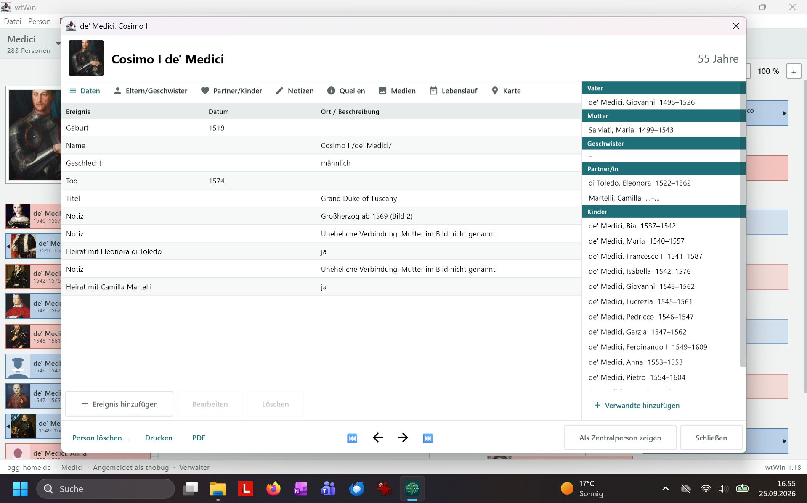 | 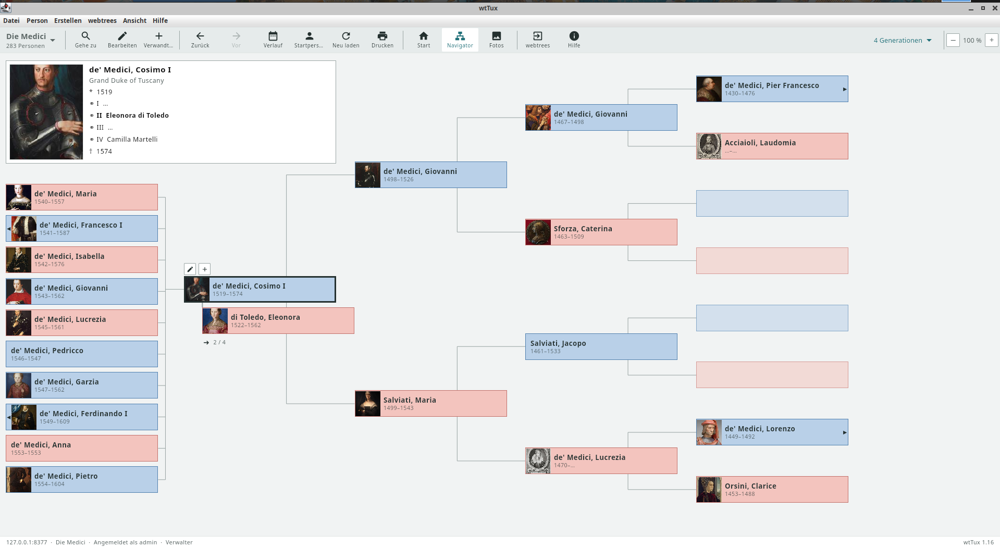 |
| :-: | :-: |
| **Personenblatt** – Ereignisse als Tabelle, die Familie daneben, Drucken und PDF | **wtTux unter Linux** – dasselbe Programm |

<p align="center">
  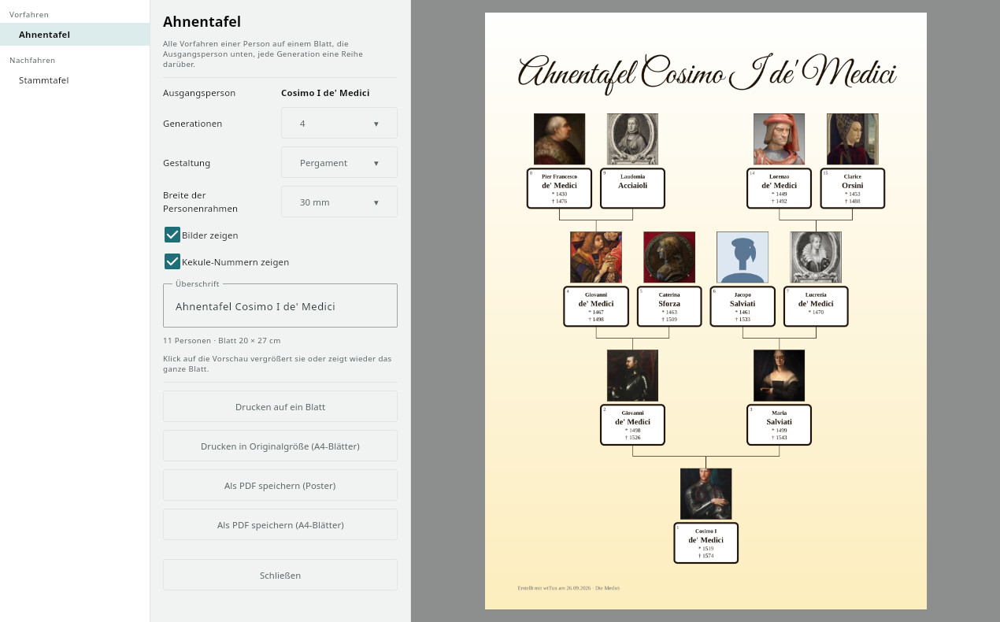
  <br><b>Tafel erstellen</b> – Tafelart, Generationen, Gestaltung (Pergament, Klassisch, Farbig, Schwarzweiß), Bilder und Kekule-Nummern; die Vorschau ist das fertige Blatt, zum Drucken oder als PDF.
</p>

| 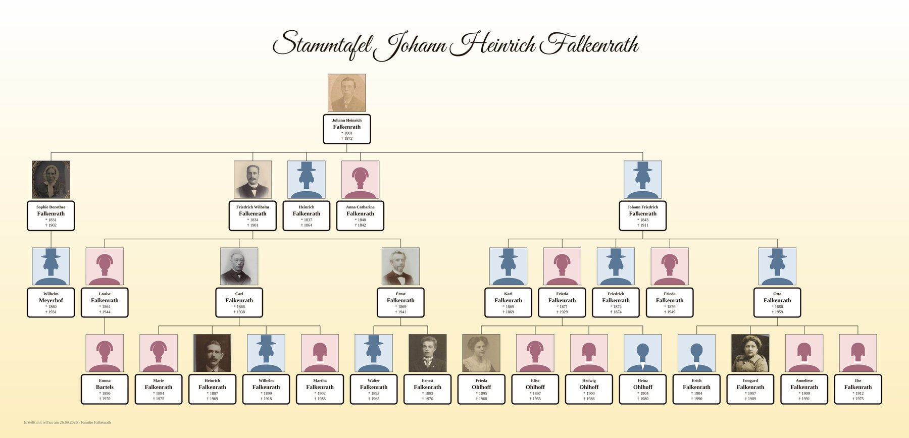 | 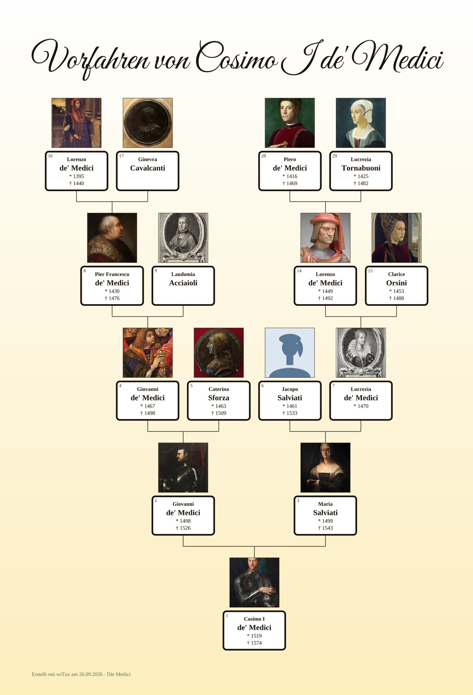 |
| :-: | :-: |
| **Stammtafel** – alle Nachfahren auf einem Blatt | **Ahnentafel** – Proband unten, Kekule-Nummern |

<p align="center"><sub>Historischer Stammbaum der Medici. Porträt Caterina Sforza: <a href="https://commons.wikimedia.org/wiki/File:Italia,_caterina_riario_di_forl%C3%AC,_riproduzione_della_medaglia_del_1488_ca..JPG">Sailko</a>, <a href="https://creativecommons.org/licenses/by-sa/3.0/">CC BY-SA 3.0</a>; alle anderen Porträts gemeinfrei (Wikimedia Commons).</sub></p>

**Android:** Die APK ist signiert. Außerhalb des Play Store muss Android einmalig erlauben, dass der Browser Apps installiert.  
**Linux:** Das Paket mit `sudo apt install ./wttux_…_amd64.deb` installieren.  
**Windows:** `wtWin-….exe` starten, installiert pro Benutzer ohne Adminrechte. Die Datei ist nicht signiert, darum warnt Windows beim ersten Start vor einem unbekannten Herausgeber: „Weitere Informationen" und dann „Trotzdem ausführen".

Auf dem webtrees-Server muss das Modul [api4webtrees](https://github.com/thobgg/api4webtrees) installiert sein.

Eine native Android-App für [webtrees](https://webtrees.net/) – den eigenen Stammbaum auf Handy und Tablet
ansehen **und bearbeiten**, mit den eigenen Daten auf dem eigenen Server.

Die App bringt zwei Welten zusammen: die Person, die den Stammbaum am PC akribisch pflegt, und die Familie, die am
Handy oder Tablet hineinschauen und mit Fotos und Hinweisen beitragen will. Die Detailarbeit bleibt am PC. Was aus der
App kommt, landet als ausstehende Änderung in derselben webtrees-Installation, unter deren Rechten, Moderation und Regeln.

| Baum | Lebenslauf | Archiv |
| - | - | - |
| 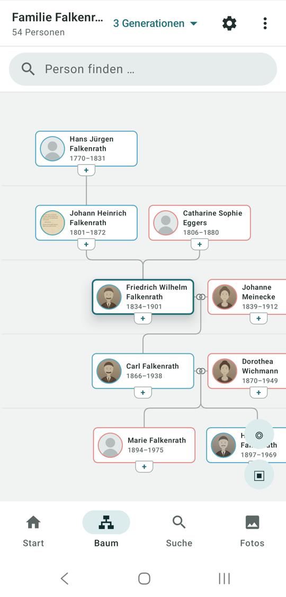 | 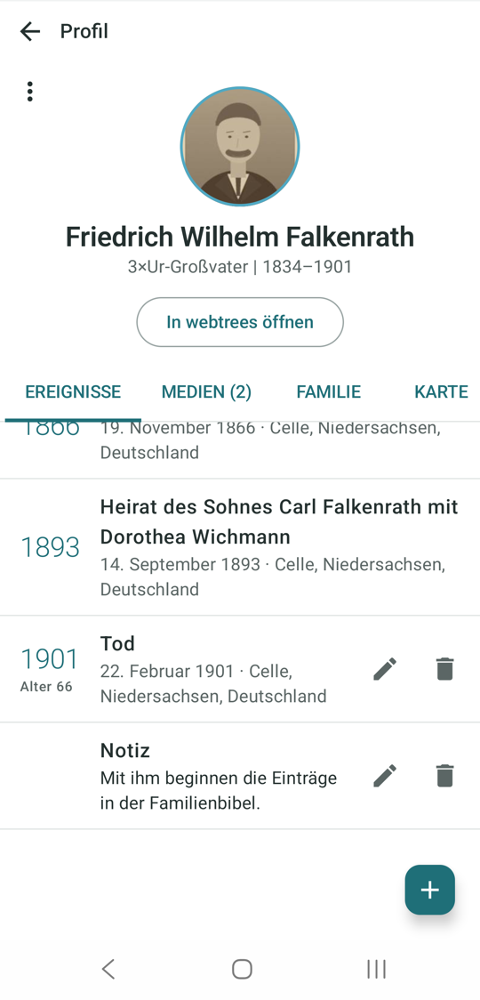 | 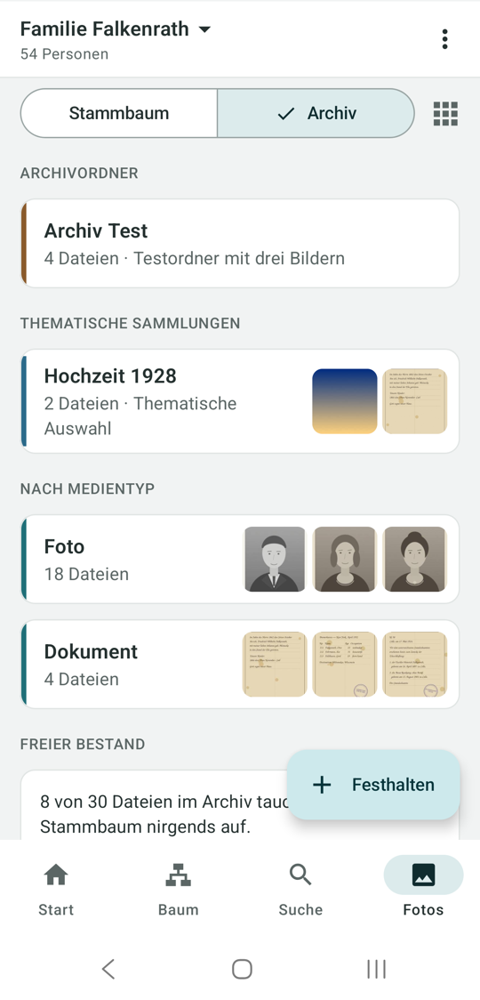 |

<sub>**wtAnd am Handy.** Die Handy-Bilder zeigen den frei erfundenen Demo-Stammbaum „Familie Falkenrath" (siehe [demo-tree/](demo-tree/)).</sub>

## Deine Daten bleiben deine

- Der Stammbaum liegt auf **deinem** webtrees-Server, die App ist nur ein Fenster dazu. Kein Konto bei einem Anbieter,
  kein Abo, keine Werbung, kein Weg, der die Daten festhält.
- Beschriftungen von Fotos, Beschreibung, Datum, Personen, schreibt die App **in die Bilddatei** (EXIF/XMP), nicht in
  eine Datenbank, die nur eine Firma lesen kann. Die Angaben wandern mit dem Foto, wohin es auch geht.
- Dateien im Archiv müssen an niemandem hängen. Dreißig Aufnahmen eines Vorfahren, von denen drei an seinem Datensatz
  gehören, die anderen siebenundzwanzig sind das Archiv.
- Quelloffen unter GPL, wie webtrees selbst.

## Was die App kann

- **Baum als Mittelpunkt:** Sanduhr-Ansicht mit Ahnen, Partnern, Kindern und Enkeln – dazu, wie in einer
  Familienansicht üblich, die Geschwister des Probanden und seiner Ahnen samt Partnern sowie die Cousins
  (beides abschaltbar);
  frei verschieben und zoomen, Zweige nach oben aufklappen, jede Person zum Probanden machen. Beim Herauszoomen
  zeigt eine Karte weniger statt kleiner: erst ohne Porträt und Jahre, dann nur der Rufname, zuletzt ein Kasten in der
  Geschlechtsfarbe, die Schrift bleibt lesbar
- **Profil:** Lebenslauf als Zeitleiste (mit Heirat und Geburten der Kinder), Verwandtschaft zur eigenen Person
  („Großvater väterlicherseits"), Fotos, Familie, Karte der Lebensstationen (OpenStreetMap)
- **Bearbeiten:** Ereignisse anlegen, ändern, löschen – auch Heirat und andere Familienereignisse; Verwandte direkt im
  Baum über das „+" an jeder Karte anlegen; Verknüpfungen lösen, Personen löschen. Datumsangaben werden ausgewählt
  (genau, um, vor, nach, zwischen · Tag, Monat, Jahr), Orte schlägt die App beim Tippen aus dem Baum vor
- **Fotos:** aufnehmen oder auswählen und einer Person zuordnen – sie werden passend zum Upload-Limit des Servers
  verkleinert; Fotoübersicht des ganzen Baums. Ein Tipp öffnet den Betrachter: wischen, kneifen, Doppeltipp
- **Archiv:** Läuft auf dem Server das Modul [Sammlungen](https://github.com/thobgg/webtrees-sammlungen) (ab 1.6),
  zeigt der Bereich „Fotos“ auch dessen Archiv – Ordner-Sammlungen, thematische Sammlungen, Sammlungen nach
  Medientyp, und vor allem die Bilder, die an keiner Person hängen. Jede Kachel sagt, wie das Bild am Stammbaum
  hängt: an Personen, als Medienobjekt ohne Person oder als freie Datei. Bearbeitet wird im Modul
- **Festhalten:** unterwegs ein Foto aus der Schublade abfotografieren, Ordner wählen, Beschreibung, Datum und Personen
  dazu (Namen schlägt die App aus dem Baum vor), fertig – es landet als Datei im Archiv, mit den Angaben als EXIF in
  der Datei, ohne an einer Person zu hängen (Modul Sammlungen ab 1.7). Verwalter ändern die Beschriftung eines
  Fotos direkt im Betrachter, aus Archiv, Baum und Profil
- **Dokumente:** PDFs aus Archiv, Baum und Profil öffnen im eigenen Betrachter, Seite für Seite, ohne Browser-Fenster
- **Jahrestage:** die nächsten Geburts-, Heirats- und Todestage, auf Wunsch mit täglicher Erinnerung
- **Freigabe:** Moderatoren nehmen ausstehende Änderungen direkt in der App an oder verwerfen sie
- **Handy kompakt, Tablet umfassend:** am Tablet stehen Profil und Baum nebeneinander
- Deutsch und Englisch; Geräte in anderen Sprachen sehen Englisch. Die Beschriftungen des Servers kommen in der Sprache der App

Alles, was (noch) nicht nativ geht, öffnet die App als webtrees-Seite in derselben Sitzung.

## Voraussetzung: das webtrees-Modul

webtrees hat keine Schnittstelle für Apps. Die App spricht deshalb mit dem Modul
**[api4webtrees](https://github.com/thobgg/api4webtrees)**, das auf dem eigenen webtrees-Server (2.2.x)
nach `modules_v4/` kopiert wird. Der webtrees-Kern bleibt unverändert.

Optional: Mit dem Modul **[Sammlungen](https://github.com/thobgg/webtrees-sammlungen)** ab Version 1.6 zeigt die App
zusätzlich das Archiv. Fehlt es, fehlt nur der Reiter.

## Datenschutz

- Die App meldet sich mit dem normalen webtrees-Konto an. Jede Anfrage läuft als dieser Benutzer – es gelten dieselben
  Datenschutzregeln wie auf der Website (lebende Personen, gesperrte Einträge, private Bäume).
- Änderungen landen sofort in webtrees: mit „Änderungen automatisch annehmen" gelten sie gleich, sonst warten sie auf
  die Freigabe durch einen Moderator.
- Gespeichert werden Serveradresse, Benutzername und das Sitzungs-Cookie – **nie das Passwort**. Kein Cloud-Backup der
  App-Daten, keine Analyse, keine Werbung, keine Google-Dienste.
- Berechtigungen: Internet. Für die abschaltbare tägliche Erinnerung an Jahrestage: Benachrichtigungen (wird erst beim
  Einschalten erfragt) sowie die üblichen Rechte des Android-Aufgabenplaners (Netzwerkstatus, Start nach Neustart,
  Wachbleiben, Vordergrunddienst). Für „Foto aufnehmen" ist keine Kamera-Berechtigung nötig – die Kamera-App des Geräts
  macht das Bild. Kein Zugriff auf Kontakte, Standort oder Dateien.

## Bilder

**Baum.** Sanduhr um den Probanden, Geschwister und Cousins dazu. Beim Herauszoomen zeigt eine Karte weniger statt
kleiner, die Schrift bleibt lesbar.

| nah | Namen | Rufnamen | Übersicht |
| - | - | - | - |
|  | 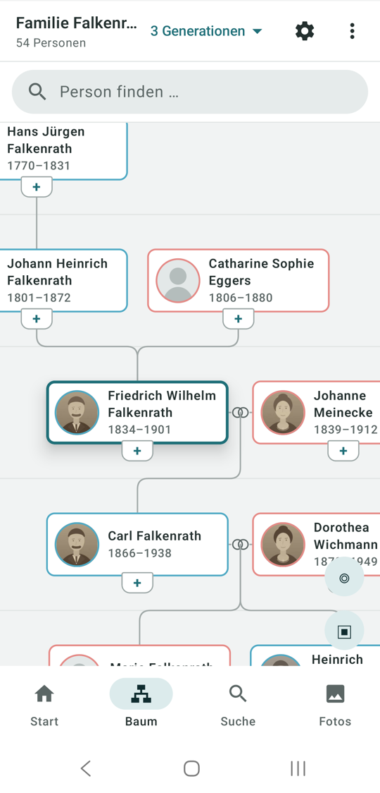 | 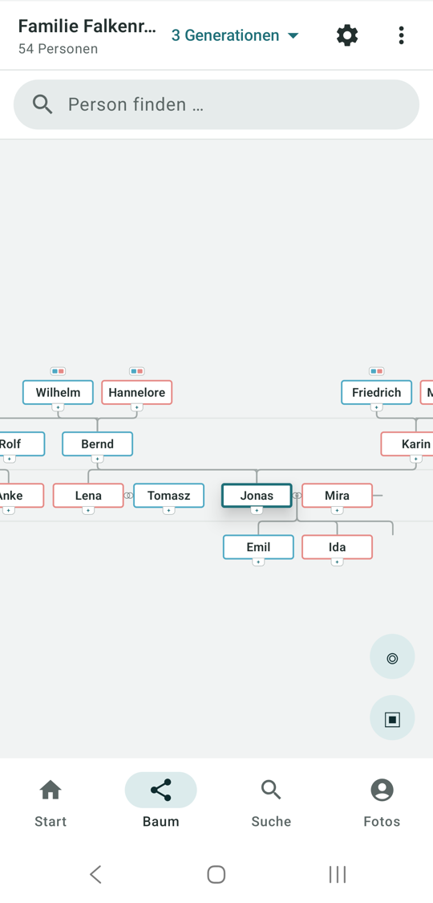 | 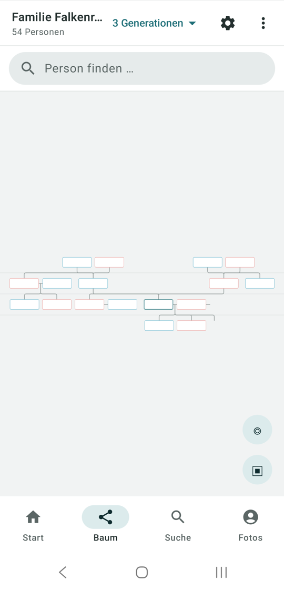 |

**Person.** Lebenslauf als Zeitleiste mit Heirat, Geburten und Heiraten der Kinder und dem Sterbealter; Familie mit
Eltern, Geschwistern, Partnern und Kindern; Karte der Lebensstationen.

| Profil | Zeitleiste | Familie | Karte |
| - | - | - | - |
| 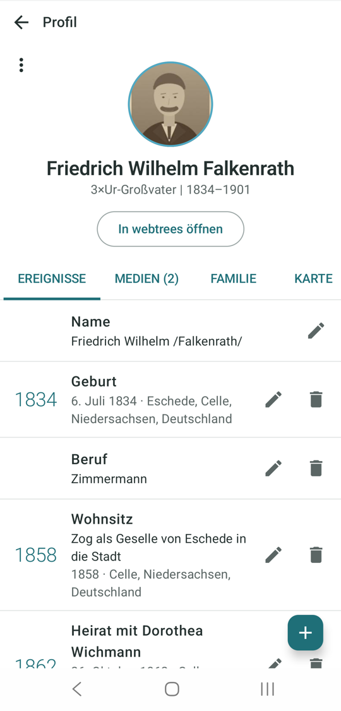 |  | 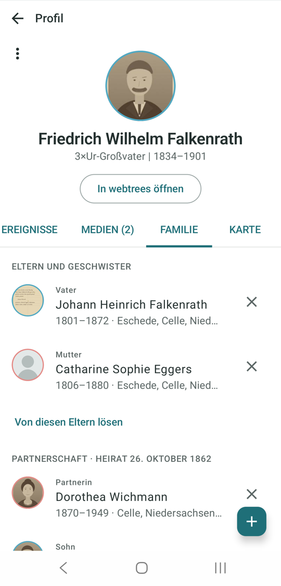 | 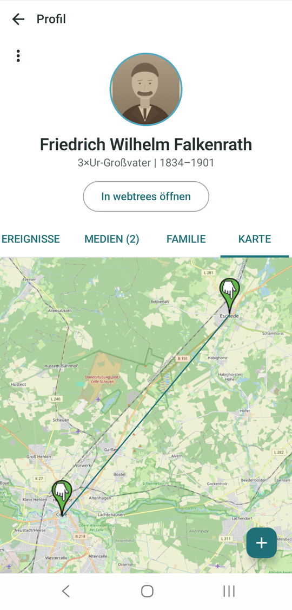 |

**Fotos und Archiv.** Die Fotos des Baums, wahlweise dicht; das Archiv des Sammlungen-Moduls mit Ordner-Sammlungen,
thematischen Sammlungen und dem freien Bestand; der Betrachter mit Kneifzoom und Beschriftung; PDFs Seite für Seite.

| Fotos | dicht | Sammlung | Betrachter |
| - | - | - | - |
| 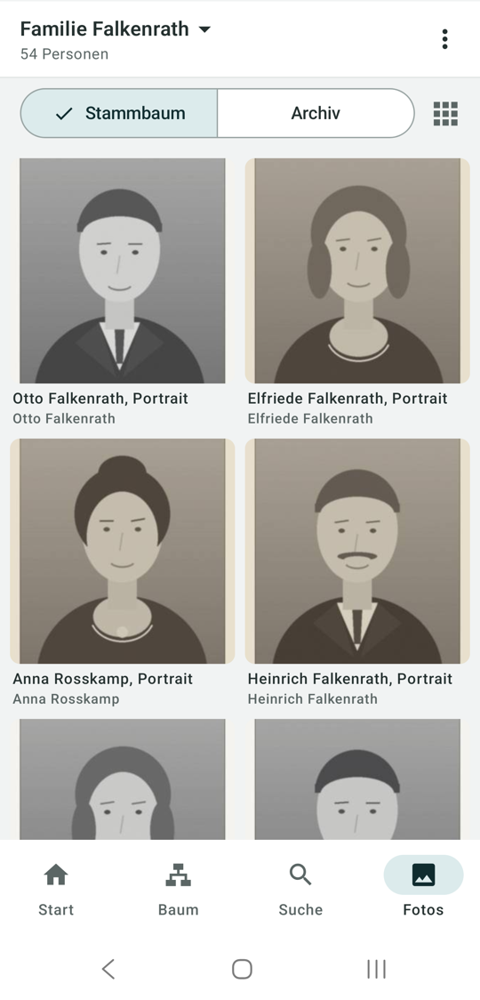 | 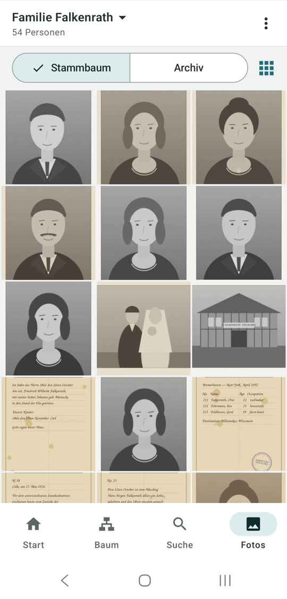 | 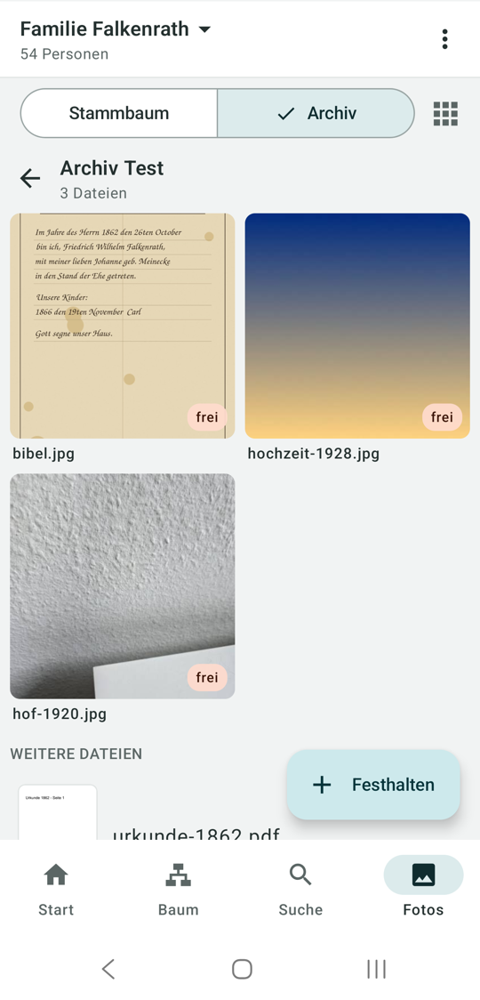 | 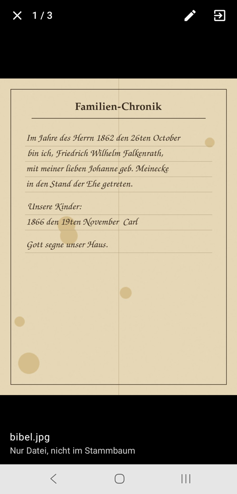 |

**Start, Suche, Dokumente, Tablet.**

| Start | Suche | PDF | Tablet |
| - | - | - | - |
| 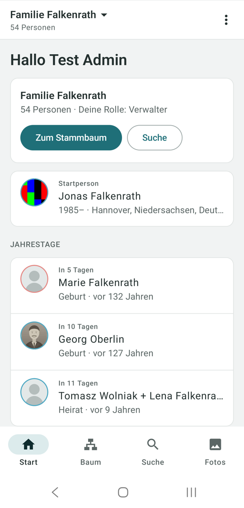 | 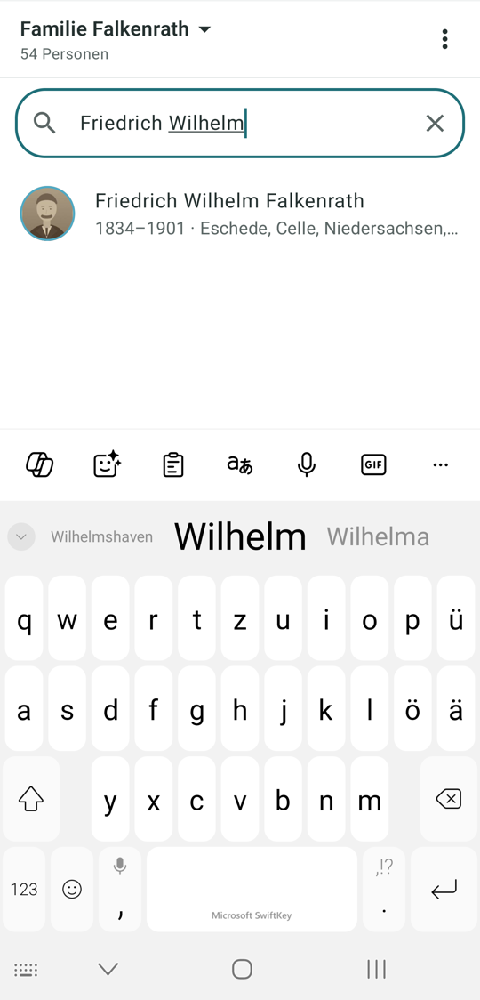 | 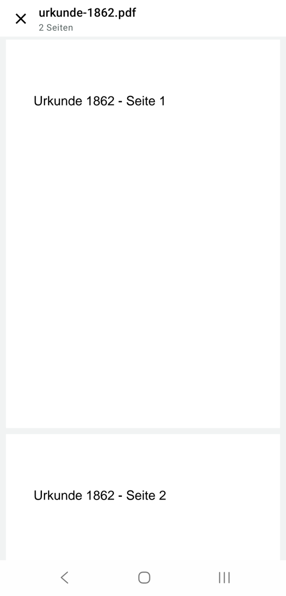 |  |

## Selbst bauen

```bash
./gradlew :app:assembleDebug
```

`minSdk` 26, `compileSdk` 36, Kotlin und Jetpack Compose. Der Build braucht ein **JDK 21**. Für einen signierten
Release liest der Build `keystore.properties` im Projektwurzelverzeichnis (nicht eingecheckt); fehlt die Datei, wird
mit dem Debug-Schlüssel signiert.

| Ordner | Inhalt |
| - | - |
| `app/` | die App |
| `demo-tree/` | Demo-Stammbaum „Familie Falkenrath" (GEDCOM + Bilder, frei erfunden, CC0) |
| `docs/` | Gestaltungs-Leitfaden und Bildschirmfotos |
| `tools/` | Hilfsskripte: Demo-Baum erzeugen, Server prüfen, UI-Tests per adb |

Einstieg in den Code: `MainActivity` zeigt `ui/MainScreen.kt` (Bildschirmwahl, Navigation, Menü). Der Zustand liegt in
`ui/UiState.kt`, das View-Model `ui/AppViewModel.kt` hält ihn; seine Aktionen stehen nach Bereich in `SessionActions`,
`TreeActions`, `EditActions`, `PhotoActions` und `AnniversaryActions`. Jeder Bereich hat seine Datei (`TreeSection`, `HomeSection`,
`SearchSection`, `PhotosSection`), das Profil besteht aus `ProfilePanel`, `Timeline`, `Relatives` und `LifeMap`.
`api/` spricht mit dem Modul, `ui/tree/` rechnet und zeichnet den Baum, `data/` bereitet Datumsangaben und Fotos auf.

## Lizenz

[GPL-3.0](LICENSE), wie webtrees. Der Demo-Stammbaum in `demo-tree/` steht unter CC0.

Verwandt: [wtAnd (Wrapper)](https://github.com/thobgg/wtAnd-wrapper) – die schlanke WebView-Hülle für alle,
die kein Modul installieren möchten.
