# wtAnd

**Deutsch** · [English](README.en.md)

<p align="center">
  
</p>

<p align="center">
  <a href="https://github.com/thobgg/app4webtrees/releases/latest"></a>
  <a href="https://github.com/thobgg/app4webtrees/releases/latest"></a>
  <a href="https://github.com/thobgg/app4webtrees/releases/latest"></a>
  <a href="https://github.com/thobgg/app4webtrees/releases/latest"></a>
</p>

<p align="center"><b>Neu in 1.38: Verzeichnisschutz.</b> Schützt dein Webserver die ganze Seite mit eigenem Benutzernamen und Passwort (.htaccess, der Browser zeigt vor webtrees ein kleines Anmeldefenster – etwa gegen Daten sammelnde Bots), trägst du diese Zugangsdaten auf dem Adressbildschirm unter „Verzeichnisschutz“ ein. wtAnd, wtWin und wtTux schicken sie mit jeder Anfrage an genau diesen Server mit; die Anmeldung bei webtrees folgt getrennt. Am Modul ändert sich nichts.</p>

<p align="center"><b>Neu in 1.37: Aufgaben, Merkliste, Änderungen.</b> Forschungsaufgaben wie in webtrees (Ansicht › Aufgaben, auch aus der Plausibilitätsprüfung), die Merkliste in den webtrees-Favoriten mit Favoriten für den ganzen Stammbaum, die letzten Änderungen des Baums, Pfeile für die Reihenfolge von Partnern und Kindern, und ein kompakter Dialog zum Zusammenführen. Braucht api4webtrees 1.18.0 – damit ist die Schnittstelle vollständig.</p>

<p align="center"><b>Neu in 1.36: Personen zusammenführen.</b> Doppelte Personen findet die Plausibilitätsprüfung (gleicher Name und gleiches Ereignisdatum, oder ähnlich); unter Person › Personen zusammenführen stehen beide nebeneinander, du wählst, was bleibt – alle Verweise wandern mit. Jedes Zusammenführen steht im Protokoll und lässt sich rückgängig machen, auch Tage später. Braucht api4webtrees 1.17.1; nur für Verwalter des Stammbaums. <b>Familienansicht neu:</b> Vorfahren beider Partner über bis zu vier Generationen, Paarkarten, Kinder mit Partnern und Enkeln, Linien, eingepasst in die Fensterhöhe.</p>

<p align="center">
  
  <br><b>Familienansicht</b> (neu in 1.36) – Vorfahren oben, das Paar in der Mitte, Kinder mit Partnern und Enkeln unten, eingepasst in die Fensterhöhe.
</p>

<p align="center">
  
  <br><b>Personen zusammenführen</b> (ab 1.36) – wer bleibt, wer aufgeht, und nur das, was von der zweiten Person dazukommt; darunter, was danach auf die bleibende Person zeigt, und weitere Paare. „Alle Ereignisse anzeigen“ klappt die vollständige Gegenüberstellung auf.
</p>

<p align="center"><b>Neu in 1.35: Häuser und Höfe.</b> Gebäude sind eigene Orte nach GEDCOM-L – in der Ortsverwaltung mit ihrer Geschichte (Brand, Umbau, Bewohner, Besitzer der Zeit nach), im Familienbuch als Häuserteil mit Querverweisen. Zum Ausprobieren: <a href="https://github.com/thobgg/falkenrath-demo-tree">Demo-Stammbaum 1.4</a>.</p>
<p align="center"><b>Neu in 1.33: fünf Sprachen.</b> wtWin, wtTux und wtAnd sprechen jetzt auch Englisch, Französisch, Niederländisch und Spanisch – umschaltbar unter Ansicht › Sprache (am Handy im Menü), mit Hilfe und Plausibilitätsprüfung in jeder Sprache.</p>

<p align="center"><b>Neu in 1.31/1.32: Paten und Trauzeugen.</b> Unter Taufe und Heirat stehen die Paten bzw. Trauzeugen – verknüpfte anklickbar, frei eingetragene als Text (auch aus den GEDCOM-L-Feldern _GODP/_WITN). Bei jeder Person steht, wo sie selbst Pate oder Zeuge war. Ab 1.32 lassen sie sich im Personenblatt auch eintragen – aus dem Baum oder ohne Datensatz, wie im Kirchenbuch –, dazu die Heiratsart. Braucht <a href="https://github.com/thobgg/api4webtrees/releases">api4webtrees 1.12</a> auf dem Server.</p>

<p align="center"><b>Neu in 1.26: der Stammbaum auf dem PC – ohne Server.</b> wtWin (unter Linux wtTux) installieren, GEDCOM-Datei aus dem bisherigen Programm wählen – fertig. Kein Server, kein Passwort, kein Internet; webtrees läuft unsichtbar im Hintergrund.</p>

<p align="center">
  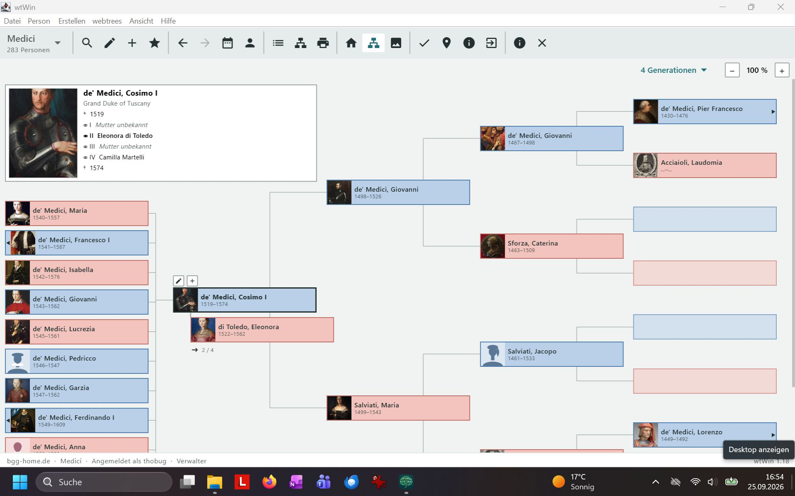
  <br><b>wtWin unter Windows</b> – derselbe Stammbaum wie in wtAnd, aufgebaut wie ein klassisches Genealogie-Programm.
</p>

<p align="center">
  
  <br><b>Vollbild</b> (ab 1.28) – nur der Baum, bis zu sieben Generationen; Esc zurück.
</p>

| 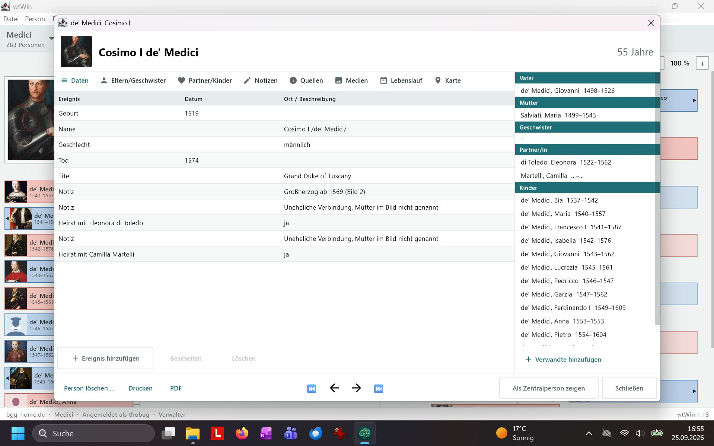 |  |
| :-: | :-: |
| **Personenblatt** – Ereignisse als Tabelle, die Familie daneben, Drucken und PDF | **Aufbau „Baum im Mittelpunkt“** (Ansicht › Aufbau) – links die Personenliste, in der Mitte der Baum als Sanduhr, rechts die Personentafel |

<p align="center">
  
  <br><b>Paten und Trauzeugen</b> (ab 1.31) – unter Taufe und Heirat, verknüpfte Paten führen zur Person, ⓘ zeigt die Notiz zum Paten, das Symbol daneben die Quelle; darunter, wo die Person selbst Pate oder Zeuge war. Im Lebenslauf am Handy genauso.
</p>

<p align="center">
  
  <br><b>Paten eintragen</b> (ab 1.32) – im Personenblatt an Taufe oder Heirat: Person aus dem Baum oder ohne Datensatz, Reihenfolge, Rolle und Notiz. Gespeichert wie in webtrees, Personen ohne Datensatz als GEDCOM-L _GODP/_WITN.
</p>

<p align="center">
  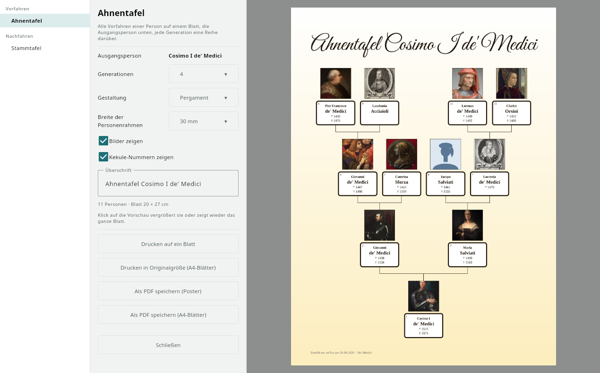
  <br><b>Tafel erstellen</b> – Tafelart wählen, gestalten (Stil, Kastenform, Hintergrund, Rahmen, Farben, Legende), Inhalt einstellen; die Vorschau ist das fertige Blatt, zum Drucken, als PDF, auf A4-Blätter zum Kleben, für den Plotter oder als Bild.
</p>

|  |  |
| :-: | :-: |
| **Ahnentafel** – Vorfahren, Kekulé-Nummern, Farben nach Linie | **Stammtafel** – alle Nachfahren auf einem Blatt |
|  |  |
| **Ahnenkreis** – sieben Generationen im Kreis | **Zeitleiste** – wer lebte wann |
|  |  |
| **Verwandtschaftsweg** – wie zwei Personen verwandt sind | **Großdruck** – Blätter zum Kleben oder Plotter |

**[Alle 15 Tafelarten, Listen und Bücher mit Beispielen →](docs/GALERIE.md)** Ahnentafel (auch seitenweise), Fächertafel, Ahnenkreis, Zeitleiste, Stammlinie, Mutterstamm, ältester Vorfahr, Stammtafel (auch seitenweise), Nachfahren der Großeltern, Sanduhr, Sanduhr eines Paares, Verwandtschaftstafel, Verwandtschaftsweg.

<p align="center">
  
  <br><b>Plausibilitätsprüfung</b> (ab 1.22, erweitert in 1.23) – 61 Regeln prüfen den ganzen Stammbaum: Tod vor Geburt, Mutter zu jung, Pate schon gestorben, mögliche Dubletten, Ortsvarianten, eigener Vorfahr … Voreinstellungen von streng bis großzügig, Grenzen einstellbar; geprüfte Treffer abhaken, das Ereignis direkt aus dem Treffer bearbeiten, Drucken und PDF.
</p>

<p align="center">
  
  <br><b>Hilfe im Programm</b> (ab 1.27) – F1 öffnet zwölf Kapitel mit Suche, in jedem Fenster gleich das passende; Fachbegriffe in den Einstellungen erklären sich beim Überfahren mit der Maus:
</p>

<p align="center"></p>

<p align="center"><sub>Alle Bilder: frei erfundener Demo-Stammbaum <a href="https://github.com/thobgg/falkenrath-demo-tree">Familie Falkenrath</a> (CC0), Fotos unbekannter Personen aus dem Rijksmuseum Amsterdam (CC0).</sub></p>

**Android:** Die APK ist signiert. Außerhalb des Play Store muss Android einmalig erlauben, dass der Browser Apps installiert.  
**Linux:** Das Paket mit `sudo apt install ./wttux_…_amd64.deb` installieren.  
**Windows:** `wtWin-….exe` starten. Der Installer fragt zuerst nach der Sprache (Deutsch, Englisch, Französisch, Niederländisch, Spanisch) und installiert pro Benutzer ohne Adminrechte; ab 1.42 ersetzt er auch eine ältere Fassung von selbst. Die Datei ist nicht signiert, darum warnt Windows beim ersten Start vor einem unbekannten Herausgeber: „Weitere Informationen" und dann „Trotzdem ausführen".  
**macOS (zum Testen):** `wtMac-…-arm64.dmg` für Macs mit Apple-Chip, `…-x64.dmg` für Intel-Macs; öffnen und wtMac in „Programme“ ziehen. Die Datei ist nicht signiert: beim ersten Start unter Systemeinstellungen › Datenschutz & Sicherheit „Trotzdem öffnen“. Noch nicht auf einem echten Mac getestet – Rückmeldungen gern als Issue.

**Mit oder ohne Server:** wtWin und wtTux verbinden sich mit einem vorhandenen webtrees, dort muss das Modul [api4webtrees](https://github.com/thobgg/api4webtrees) installiert sein. Oder sie legen den Stammbaum **auf diesem PC** an, leer oder aus einer GEDCOM-Datei aus dem bisherigen Programm (ab 1.26). Dafür bringen sie webtrees (unverändert aus dem [offiziellen Release](https://github.com/fisharebest/webtrees/releases), GPL-3) und PHP mit – kein Server, kein Passwort, kein Internet nötig. wtAnd und wtMac brauchen einen Server.

<p align="center"><br><b>Erster Start</b> – links mit einem webtrees-Server verbinden, rechts den Stammbaum auf dem PC anlegen.</p>

wtAnd, wtWin, wtTux und wtMac sind keine offiziellen webtrees-Produkte; Fragen und Fehler bitte als [Issue](https://github.com/thobgg/app4webtrees/issues).

Eine native Android-App für [webtrees](https://webtrees.net/) – den eigenen Stammbaum auf Handy und Tablet
ansehen **und bearbeiten**, mit den eigenen Daten auf dem eigenen Server.

So liegt der ganze Stammbaum in der Hosentasche: nachsehen, was bekannt ist, im Archiv oder auf dem Friedhof etwas
festhalten und Daten ändern. Die ausführliche Pflege, etwa Quellenverwaltung, Tafeln und Bücher, bleibt am PC
(wtWin, wtTux). Was aus der App kommt, landet als ausstehende Änderung in derselben webtrees-Installation, unter deren
Rechten, Moderation und Regeln.

| Baum | Lebenslauf | Archiv |
| - | - | - |
| 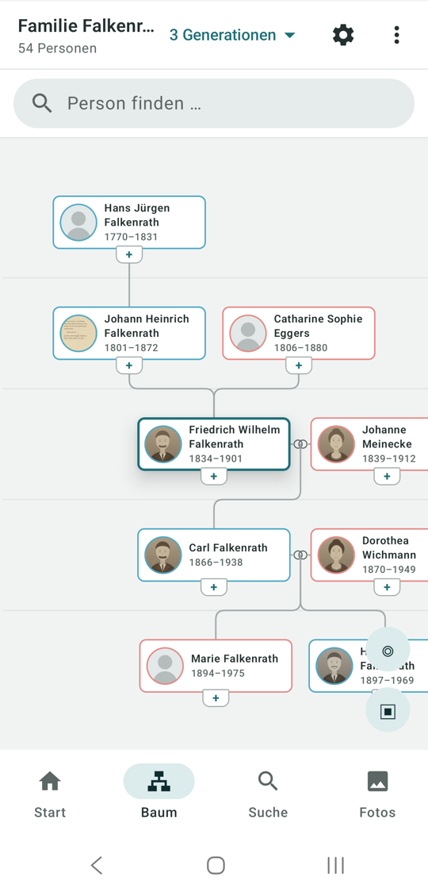 | 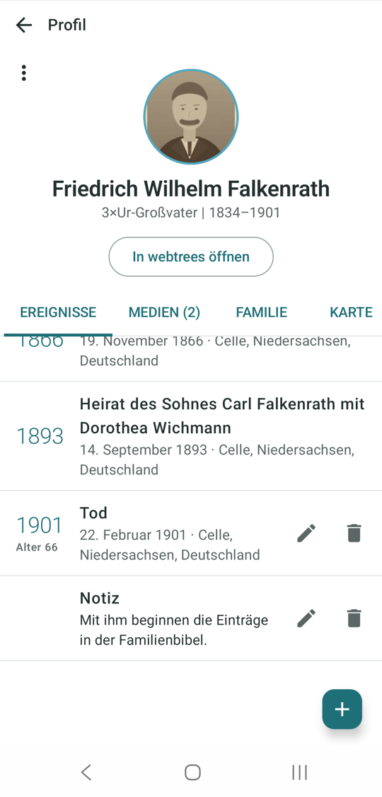 | 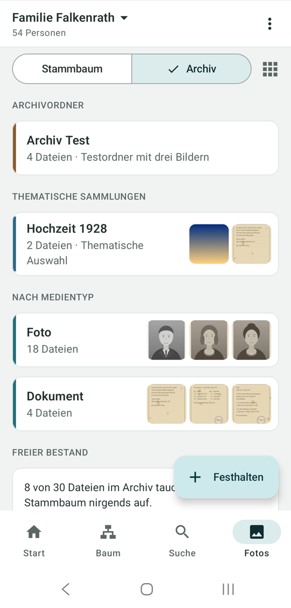 |

<sub>**wtAnd am Handy.** Die Handy-Bilder zeigen den frei erfundenen Demo-Stammbaum „Familie Falkenrath" (siehe [falkenrath-demo-tree](https://github.com/thobgg/falkenrath-demo-tree)).</sub>

## Deine Daten bleiben deine

- Der Stammbaum liegt auf **deinem** webtrees-Server, die App ist nur ein Fenster dazu. Kein Konto bei einem Anbieter,
  kein Abo, keine Werbung, kein Weg, der die Daten festhält.
- Beschriftungen von Fotos, Beschreibung, Datum, Personen, schreibt die App **in die Bilddatei** (EXIF/XMP), nicht in
  eine Datenbank, die nur eine Firma lesen kann. Die Angaben wandern mit dem Foto, wohin es auch geht.
- Dateien im Archiv müssen an niemandem hängen. Dreißig Aufnahmen eines Vorfahren, von denen drei an seinem Datensatz
  gehören, die anderen siebenundzwanzig sind das Archiv.
- Quelloffen unter GPL, wie webtrees selbst.

## Was die App kann

- **Baum als Mittelpunkt:** Sanduhr-Ansicht mit Ahnen, Partnern, Kindern und Enkeln – dazu, wie in einer
  Familienansicht üblich, die Geschwister des Probanden und seiner Ahnen samt Partnern sowie die Cousins
  (beides abschaltbar);
  frei verschieben und zoomen, Zweige nach oben aufklappen, jede Person zum Probanden machen. Beim Herauszoomen
  zeigt eine Karte weniger statt kleiner: erst ohne Porträt und Jahre, dann nur der Rufname, zuletzt ein Kasten in der
  Geschlechtsfarbe, die Schrift bleibt lesbar
- **Paten und Trauzeugen** (ab 1.31, mit api4webtrees 1.11): unter Taufe und Heirat, verknüpfte antippen öffnet die
  Person; dazu bei jeder Person „Pate bei …“ und „Zeuge bei …“. Standesamtliche und kirchliche Trauung getrennt.
  Eintragen und die Heiratsart wählen am PC mit wtWin/wtTux (ab 1.32, mit api4webtrees 1.12)
- **Profil:** Lebenslauf als Zeitleiste (mit Heirat und Geburten der Kinder), Verwandtschaft zur eigenen Person
  („Großvater väterlicherseits"), Fotos, Familie, Karte der Lebensstationen (OpenStreetMap)
- **Bearbeiten:** Ereignisse anlegen, ändern, löschen – auch Heirat und andere Familienereignisse; Verwandte direkt im
  Baum über das „+" an jeder Karte anlegen; Verknüpfungen lösen, Personen löschen. Datumsangaben werden ausgewählt
  (genau, um, vor, nach, zwischen · Tag, Monat, Jahr), Orte schlägt die App beim Tippen aus dem Baum vor
- **Fotos:** aufnehmen oder auswählen und einer Person zuordnen – sie werden passend zum Upload-Limit des Servers
  verkleinert; Fotoübersicht des ganzen Baums. Ein Tipp öffnet den Betrachter: wischen, kneifen, Doppeltipp
- **Archiv:** Läuft auf dem Server das Modul [Sammlungen](https://github.com/thobgg/webtrees-sammlungen) (ab 1.6),
  zeigt der Bereich „Fotos“ auch dessen Archiv – Ordner-Sammlungen, thematische Sammlungen, Sammlungen nach
  Medientyp, und vor allem die Bilder, die an keiner Person hängen. Jede Kachel sagt, wie das Bild am Stammbaum
  hängt: an Personen, als Medienobjekt ohne Person oder als freie Datei. Bearbeitet wird im Modul
- **Festhalten:** unterwegs ein Foto aus der Schublade abfotografieren, Ordner wählen, Beschreibung, Datum und Personen
  dazu (Namen schlägt die App aus dem Baum vor), fertig – es landet als Datei im Archiv, mit den Angaben als EXIF in
  der Datei, ohne an einer Person zu hängen (Modul Sammlungen ab 1.7). Verwalter ändern die Beschriftung eines
  Fotos direkt im Betrachter, aus Archiv, Baum und Profil
- **Dokumente:** PDFs aus Archiv, Baum und Profil öffnen im eigenen Betrachter, Seite für Seite, ohne Browser-Fenster
- **Jahrestage:** die nächsten Geburts-, Heirats- und Todestage, auf Wunsch mit täglicher Erinnerung
- **Freigabe:** Moderatoren nehmen ausstehende Änderungen direkt in der App an oder verwerfen sie
- **Handy kompakt, Tablet umfassend:** am Tablet stehen Profil und Baum nebeneinander
- Deutsch, Englisch, Französisch, Niederländisch und Spanisch, umschaltbar in der App (sonst wie das Gerät, andere Sprachen sehen Englisch). Die Beschriftungen des Servers kommen in der Sprache der App

Alles, was (noch) nicht nativ geht, öffnet die App als webtrees-Seite in derselben Sitzung.

## Voraussetzung: das webtrees-Modul

webtrees hat keine Schnittstelle für Apps. Die App spricht deshalb mit dem Modul
**[api4webtrees](https://github.com/thobgg/api4webtrees)**, das auf dem eigenen webtrees-Server (2.2.x)
nach `modules_v4/` kopiert wird. Der webtrees-Kern bleibt unverändert. Paten und Trauzeugen erscheinen ab
api4webtrees 1.11, eintragen lassen sie sich ab 1.12; mit einem älteren Modul läuft alles andere wie bisher.

Optional: Mit dem Modul **[Sammlungen](https://github.com/thobgg/webtrees-sammlungen)** ab Version 1.6 zeigt die App
zusätzlich das Archiv. Fehlt es, fehlt nur der Reiter.

## Verbinden ohne Tippen

Auf der Seite **„App“** in webtrees (api4webtrees ab 1.9.4, im Paket [nas4webtrees](https://github.com/thobgg/nas4webtrees)
schon dabei) verbindet ein Klick das Programm mit dem eigenen Konto – Adresse und Passwort muss niemand eintippen:

- **wtWin/wtTux (ab 1.21):** Programm installieren und starten, dann im Browser auf **„Mit wtWin verbinden“** klicken.
  Das Programm übernimmt den Verbinden-Link aus der Zwischenablage oder bekommt ihn direkt vom Browser
  (`wtwin://`, `wttux://` – unter Windows trägt das der Installer ab 1.42 ein, sonst meldet sich das Programm beim
  ersten Start selbst an, ohne Adminrechte), fragt einmal nach und öffnet den Baum.
- **wtAnd:** am Handy auf „Jetzt verbinden“ tippen, oder am PC den QR-Code mit der Handy-Kamera scannen.

Der Link trägt einen Einmal-Code, der 10 Minuten und genau einmal gilt; das Passwort erreicht das Gerät nie.

**Verzeichnisschutz (ab 1.38):** Schützt der Webserver die ganze Seite mit eigenem Benutzernamen und Passwort
(.htaccess/.htpasswd, der Browser zeigt vor webtrees ein kleines Anmeldefenster, etwa gegen Daten sammelnde Bots), tippt
man diese Zugangsdaten auf dem Adressbildschirm unter **„Verzeichnisschutz“** ein. Die App schickt sie mit jeder Anfrage
an genau diesen Server mit, auch für Bilder und die Erinnerung an Jahrestage; die Anmeldung bei webtrees folgt getrennt.
Die Felder klappen von selbst auf, wenn der Server so eine Anmeldung verlangt. Bei SSO-Diensten (Authelia, Authentik,
oauth2-proxy, Cloudflare Access) hilft das nicht, dort muss der Betreiber die Anfragen der App durchlassen, siehe die
README von api4webtrees.

## Datenschutz

- Die App meldet sich mit dem normalen webtrees-Konto an. Jede Anfrage läuft als dieser Benutzer – es gelten dieselben
  Datenschutzregeln wie auf der Website (lebende Personen, gesperrte Einträge, private Bäume).
- Änderungen landen sofort in webtrees: mit „Änderungen automatisch annehmen" gelten sie gleich, sonst warten sie auf
  die Freigabe durch einen Moderator.
- Gespeichert werden Serveradresse, Benutzername und das Sitzungs-Cookie – **nie das webtrees-Passwort**. Nur die
  Zugangsdaten eines Verzeichnisschutzes (falls eingetragen) bleiben auf dem Gerät, sie müssen bei jeder Anfrage mit. Kein Cloud-Backup der
  App-Daten, keine Analyse, keine Werbung, keine Google-Dienste.
- Berechtigungen: Internet. Für die abschaltbare tägliche Erinnerung an Jahrestage: Benachrichtigungen (wird erst beim
  Einschalten erfragt) sowie die üblichen Rechte des Android-Aufgabenplaners (Netzwerkstatus, Start nach Neustart,
  Wachbleiben, Vordergrunddienst). Für „Foto aufnehmen" ist keine Kamera-Berechtigung nötig – die Kamera-App des Geräts
  macht das Bild. Kein Zugriff auf Kontakte, Standort oder Dateien.

## Bilder

**Baum.** Sanduhr um den Probanden, Geschwister und Cousins dazu. Beim Herauszoomen zeigt eine Karte weniger statt
kleiner, die Schrift bleibt lesbar.

| nah | Namen | Rufnamen | Übersicht |
| - | - | - | - |
|  | 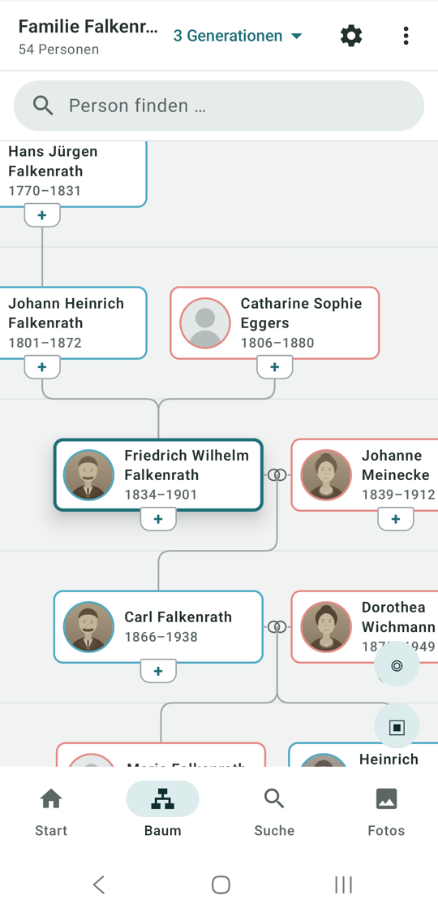 | 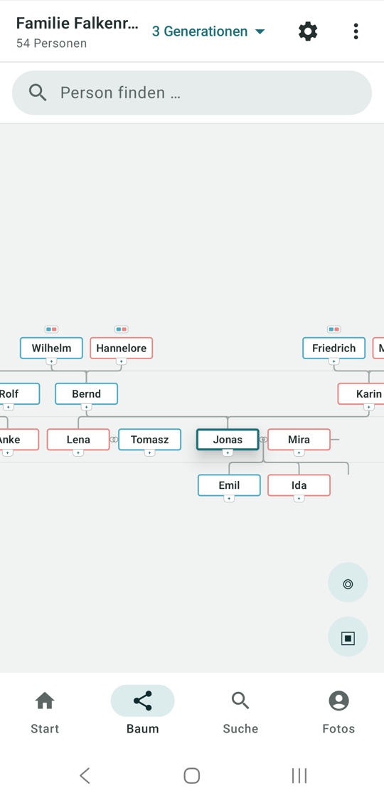 | 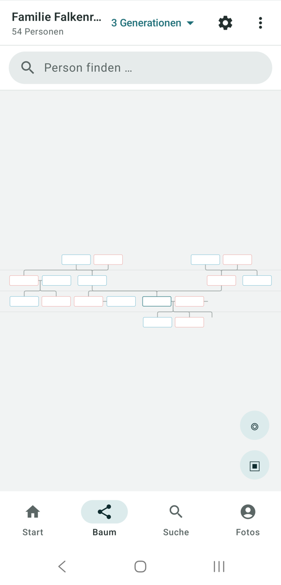 |

**Person.** Lebenslauf als Zeitleiste mit Heirat, Geburten und Heiraten der Kinder und dem Sterbealter; Familie mit
Eltern, Geschwistern, Partnern und Kindern; Karte der Lebensstationen.

| Profil | Zeitleiste | Familie | Karte |
| - | - | - | - |
| 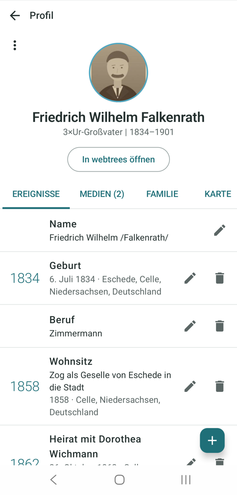 |  | 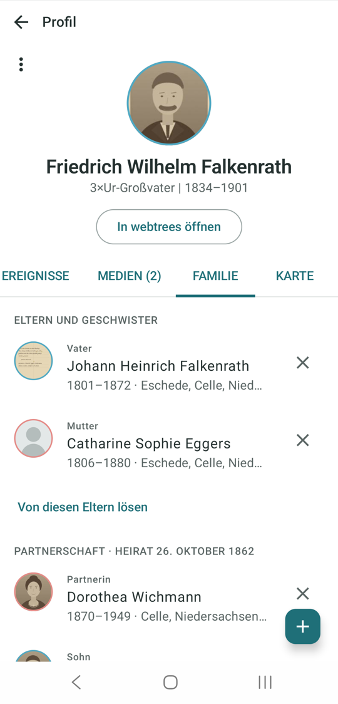 | 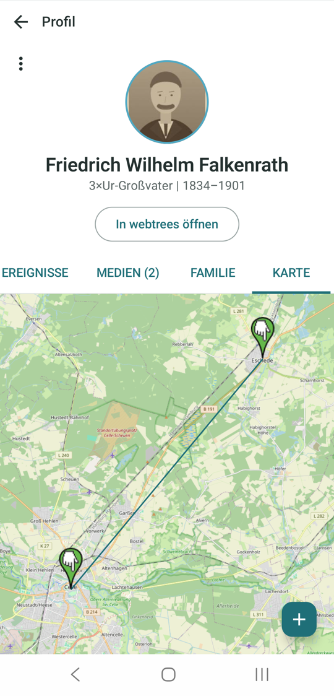 |

**Fotos und Archiv.** Die Fotos des Baums, wahlweise dicht; das Archiv des Sammlungen-Moduls mit Ordner-Sammlungen,
thematischen Sammlungen und dem freien Bestand; der Betrachter mit Kneifzoom und Beschriftung; PDFs Seite für Seite.

| Fotos | dicht | Sammlung | Betrachter |
| - | - | - | - |
| 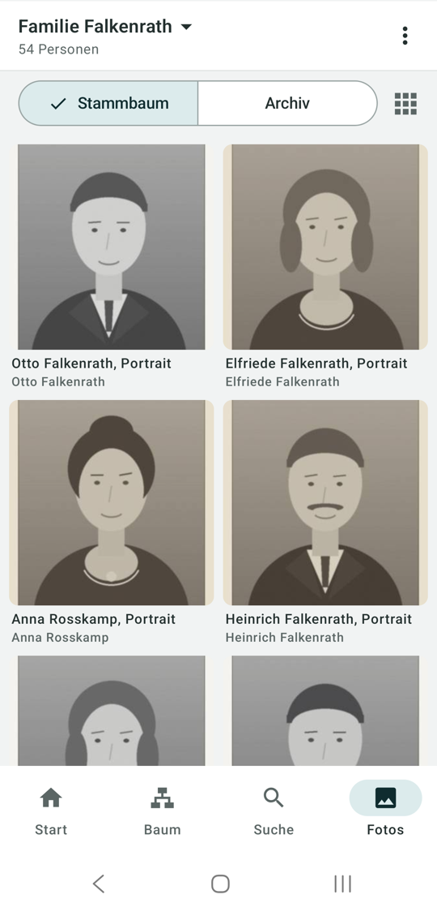 | 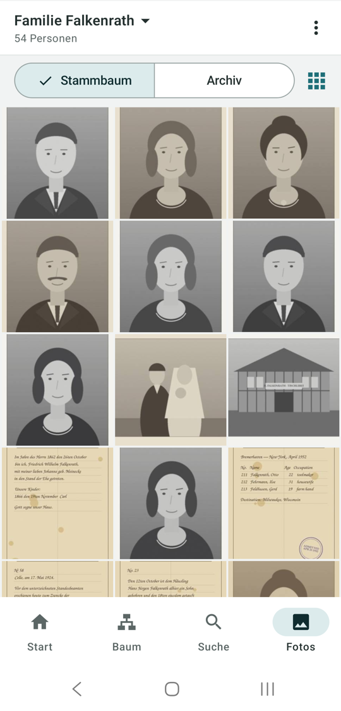 | 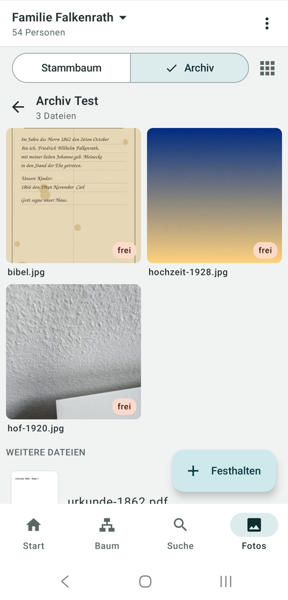 | 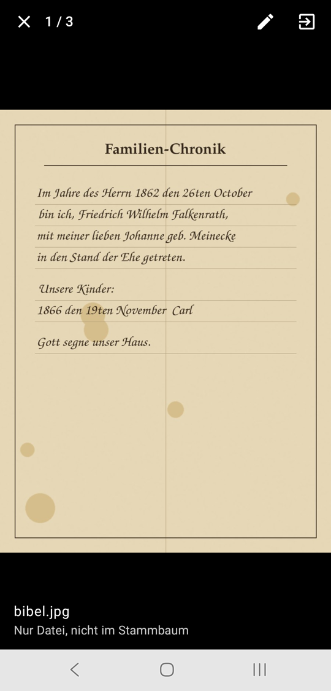 |

**Start, Suche, Dokumente, Tablet.**

| Start | Suche | PDF | Tablet |
| - | - | - | - |
| 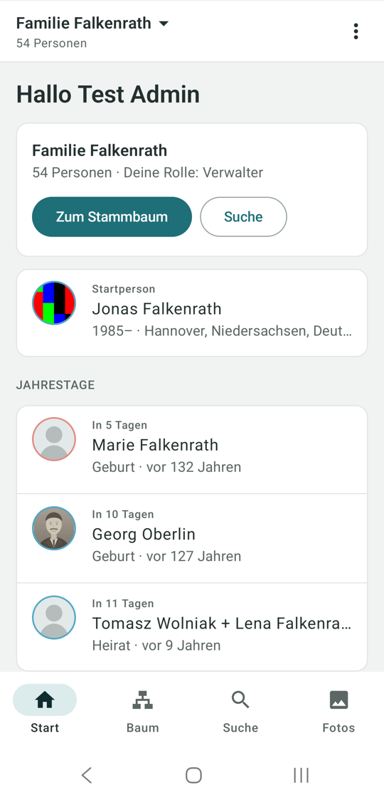 | 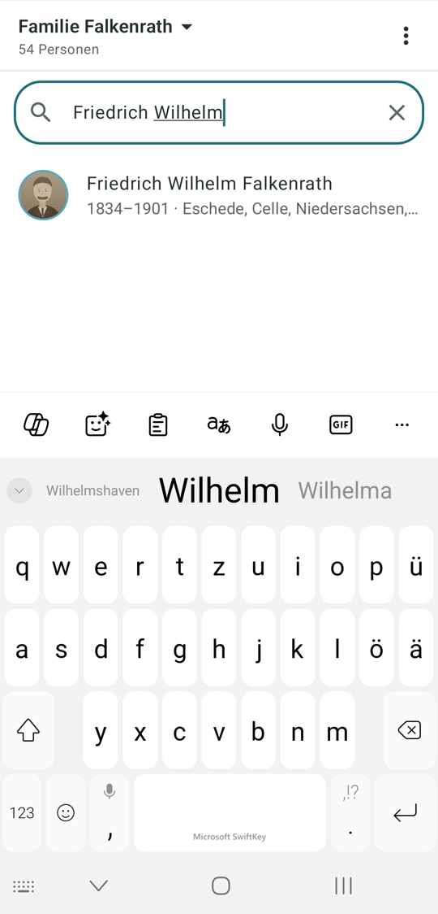 | 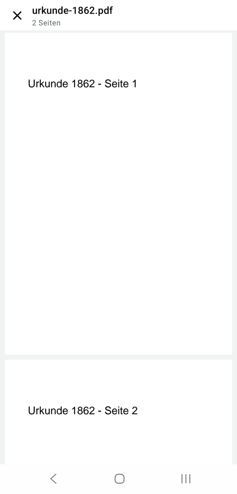 |  |

## Selbst bauen

```bash
./gradlew :app:assembleDebug
```

`minSdk` 26, `compileSdk` 36, Kotlin und Jetpack Compose. Der Build braucht ein **JDK 21**. Für einen signierten
Release liest der Build `keystore.properties` im Projektwurzelverzeichnis (nicht eingecheckt); fehlt die Datei, wird
mit dem Debug-Schlüssel signiert.

| Ordner | Inhalt |
| - | - |
| `app/` | die App |
| `testdaten/` | Demo-Stammbaum „Familie Falkenrath" 1.3 für die Tests; der Baum mit Bildern liegt in [falkenrath-demo-tree](https://github.com/thobgg/falkenrath-demo-tree) |
| `docs/` | Gestaltungs-Leitfaden und Bildschirmfotos |
| `tools/` | Hilfsskripte: Demo-Baum erzeugen, Server prüfen, UI-Tests per adb |

Einstieg in den Code: `MainActivity` zeigt `ui/MainScreen.kt` (Bildschirmwahl, Navigation, Menü). Der Zustand liegt in
`ui/UiState.kt`, das View-Model `ui/AppViewModel.kt` hält ihn; seine Aktionen stehen nach Bereich in `SessionActions`,
`TreeActions`, `EditActions`, `PhotoActions` und `AnniversaryActions`. Jeder Bereich hat seine Datei (`TreeSection`, `HomeSection`,
`SearchSection`, `PhotosSection`), das Profil besteht aus `ProfilePanel`, `Timeline`, `Relatives` und `LifeMap`.
`api/` spricht mit dem Modul, `ui/tree/` rechnet und zeichnet den Baum, `data/` bereitet Datumsangaben und Fotos auf.

## Lizenz

[GPL-3.0](LICENSE), wie webtrees. Der [Demo-Stammbaum](https://github.com/thobgg/falkenrath-demo-tree) steht unter CC0.

Verwandt: [wtAnd (Wrapper)](https://github.com/thobgg/wtAnd-wrapper) – die schlanke WebView-Hülle für alle,
die kein Modul installieren möchten.
