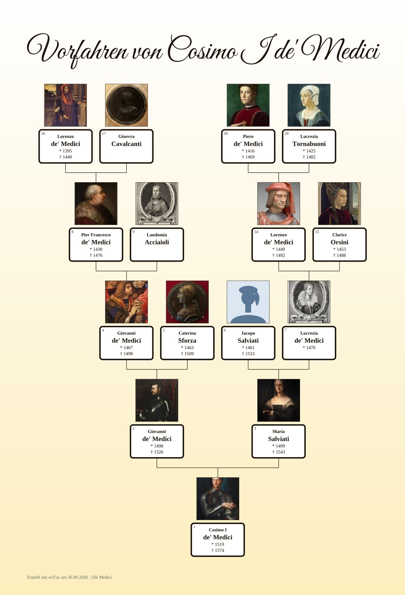
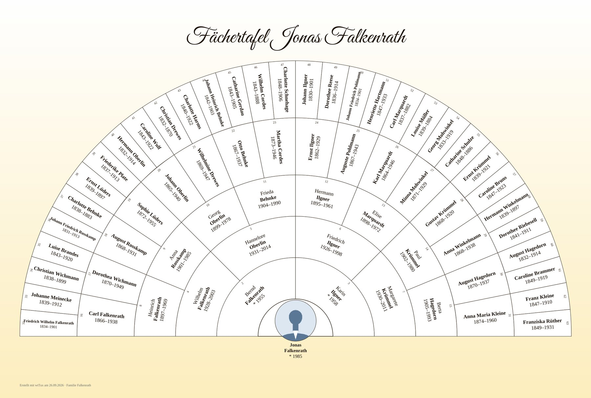
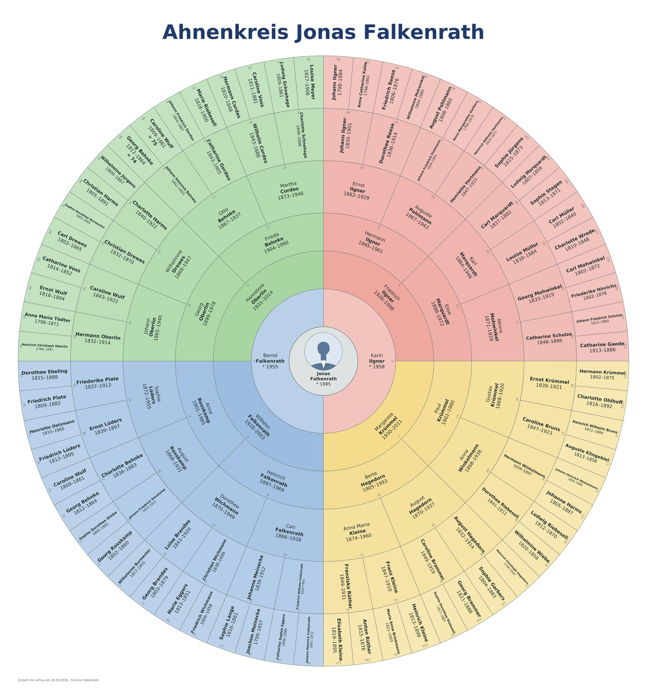
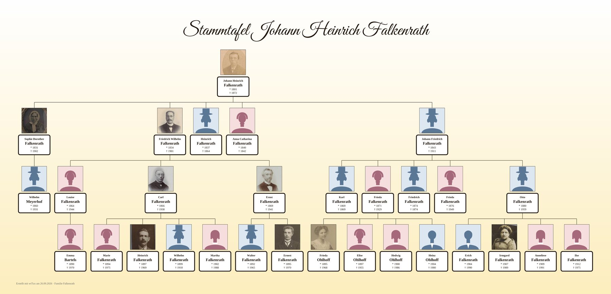

# Charts, lists and books in wtWin, wtTux and wtMac

All chart types from **Create › Descendant chart …** (Ctrl+T), each with an example from the fictitious demo tree [Familie Falkenrath](https://github.com/thobgg/falkenrath-demo-tree) (CC0; photos of unknown people from the Rijksmuseum Amsterdam, CC0). Every chart can be styled (style, box shape, background, frame, colours by line, branch or your own rules, legend), its content set (dates, places, age, occupation, call name, numbering, filters) and printed: on one sheet, as a poster PDF, on A4 sheets to glue together, as a PDF for the plotter or as a picture (PNG).

## Ancestors

|  |  |
| :-: | :-: |
| **Ancestor chart** – starting person at the bottom, ancestors above, Kekulé numbers; here coloured by the four grandparent lines with legend | **Ancestor chart on pages** – four generations per A4 page, “→ p. 5” to continue – for a binder |
|  |  |
| **Fan chart** – the half circle, here six generations with frame and legend | **Ancestor circle** – the full circle, seven generations, grandparent lines in colour |
|  |  |
| **Timeline** – life bars on a time axis – who lived when; with historical events | **Paternal line** – the line of fathers, with both parents per generation |
|  |  |
| **Maternal line** – the line of mothers | **Oldest ancestor** – the line to the oldest known ancestor |

## Descendants

|  |  |
| :-: | :-: |
| **Descendant chart** – all descendants on one sheet; here with oval boxes, round photos and shadow | **Descendant chart on pages** – a few generations per page, “→ p. 7” to continue, page overview in front, index at the back |
|  |  |
| **Descendants of the grandparents** – uncles, aunts, cousins of both sides; the parents side by side in the middle |  |

## Ancestors and descendants

|  |  |
| :-: | :-: |
| **Hourglass** – ancestors and descendants of one person, here horizontal | **Couple hourglass** – the ancestors of both partners, their common descendants below |
|  |  |
| **Relationship chart** – the descendants of all root couples of one ancestor generation – all blood relatives; duplicates as grid references | **Relationship path** – how two people are related: common ancestor, both lines, the relationship in words |

## Output

|  |  |
| :-: | :-: |
| **Large print** – on A4 sheets to glue together with an assembly plan – or as a PDF for the plotter on roll width | **Person card** – optionally one page per person behind the chart; a click on the box in the PDF jumps there |

## Lists

From the **Create** menu (ancestor list, descendant list, event list): starting from one person or across the whole tree, with a preview of the PDF pages. Also: paternal line, maternal line, descendants per generation, families, occupations and religions, person sheet.

|  |  |
| :-: | :-: |
| **Ancestor list** – up to 12 generations, Kekulé numbers, pedigree collapse as reference | **Descendant list** – up to 10 generations, numbered by Saragossa, d'Aboville, Henry or consecutively |
|  |  |
| **Ancestor statistics** – how many ancestors are known per generation, with pedigree collapse | **Top ancestors** – where each line ends, ordered by grandparent lines |
|  |  |
| **Anniversaries** – births, marriages, deaths – as a list or calendar, with place filter | **Surnames** – all surnames with count, period and places |
|  |  |
| **Places** – which families lived where and when | **Baptisms and godparents** – all baptisms of a tree with their godparents |

## Books

From **Create › Create book …**: in the style of printed local family books – every person with events, sources, godparents and notes, references to parents and children, portraits in the margin, table of contents and index. As PDF with bookmarks and links, DOCX for further editing, HTML, TeX or text. Ancestor and descendant books can get the matching chart as a fold-out page (A3).

|  |  |
| :-: | :-: |
| **Ancestor book** – title page with portrait and preface | **Ancestor book inside** – one chapter per generation, grandparent lines coloured in the margin |
|  |  |
| **Index** – names, places, occupations and sources, by entry number | **Descendant book** – with a portrait of the progenitors |
|  |  |
| **Descendant book inside** – numbered by Saragossa, d'Aboville, Henry or consecutively | **Family book** – one entry per family, alphabetical or chronological; with place filter as a local family book, with a house section (farms and houses with history, residents and owners) |

[Back to the README](../README.en.md) · [Deutsch](GALERIE.md)
